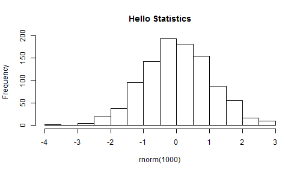

<style>
/* Your other css */
    body {
      background-image: url(https://raw.githubusercontent.com/aarora79/DS_For_HighSchoolers/master/images/background7.png);
      background-position: center center;
      background-attachment: fixed;
      background-repeat: no-repeat;
      background-size: 100% 100%;
      text-color: blue;
    }
.section .reveal .state-background {
    background-image: url(http://goo.gl/yJFbG4);
    background-position: center center;
    background-attachment: fixed;
    background-repeat: no-repeat;
    background-size: 100% 100%;
}
</style>
Lecture 1: Data Science for High Schoolers 
========================================================
author: Amit Arora
date: 2017-12-26
autosize: true

Why this workshop?
========================================================

 - There is a great interest, career prospects in this field.
 - I feel high school students are best placed for starting to learn about this field.

What will we cover?
========================================================
 - A complete data science life cycle with an actual dataset (which is not a toy dataset).
 - Montgomery College Enrollment Data.
  - https://data.montgomerycountymd.gov/Education/Montgomery-College-Enrollment-Data/wmr2-6hn6

How will we cover the various aspects of the life cycle of a datascience project?
========================================================
 - The R ecosystem of tools and technologies.
 - We will <b>all</b> find and explore a dataset of our own interest and aim to repeat the same steps that we see in class. <br>
 <i><b>I hear and I forget. I see and I remember. I do and I understand.</b></i>

The R ecosystem
========================================================

- This is not a programming class, so we are not using Python. We want to use the most effective tools for the job.
  - Python is great and wonderful and during the course of your data science journey you will use it all the time. We will use R. You will see why :).
  


The R ecosystem: R Studio and useful packages
========================================================

- Install R Studio: https://www.rstudio.com/products/rstudio/download2/ download the free R Desktop version (depending upon your laptop OS Windows/MAC you should see the right installer).

- Once R Studio is installed, install some useful packages (libraries) that we will use everyday.


```r
#copy paste the following lines in the R studio console
#remove the # sign and press enter
#install.packages(c ("dplyr", "ggplot2", "lubridate", "httr", "markdown"))
```

The R ecosystem: R Studio and useful packages (contd.)
========================================================

- what did we just install:
  - dplyr: imagine this to be like a plier for data carpentary.
  - ggplot2: implements grammar of graphics.
  - httr: package for downloading data from the Internet
  - lubridate: date/time manipulation library
  
Our first R program
========================================================
- In statistics "Normal" (a.k.a Gaussian) distributions are **continous** distributions that describe many (most?) naturally occuring phenomena.


```r
hist(rnorm(1000), main="Hello Statistics")
```


