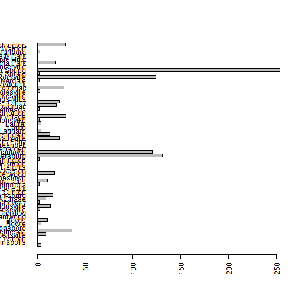

<style>
/* Your other css */
    body {
      background-image: url(https://raw.githubusercontent.com/aarora79/DS_For_HighSchoolers/master/images/background7.png);
      background-position: center center;
      background-attachment: fixed;
      background-repeat: no-repeat;
      background-size: 100% 100%;
      text-color: blue;
    }
.section .reveal .state-background {
    background-image: url(http://goo.gl/yJFbG4);
    background-position: center center;
    background-attachment: fixed;
    background-repeat: no-repeat;
    background-size: 100% 100%;
}
</style>

Lecture 2: Data Science for High Schoolers 
========================================================
author: Amit Arora
date: 2017-12-27
autosize: true

Data Ingestion
========================================================

 - We will use the "httr" package to download data from "https://data.montgomerycountymd.gov/resource/qaet-tgxg.csv"
 
 -The Montgomery County College Enrollment dataset will be the the dataset we use to explore the data science pipeline.
 
Over to the code
========================================================
 - Lets run through the code step by step..
 
 
 ```r
 #the following lines check if the package httr is already installed..
 #this is done by finding if "httr" is in the list of currently installed
 #packages procided by the "installed.package()" function which returns a 
 #list of all installed pacakges..
 #installs it if not already installed
 list.of.packages <- c("httr")
 new.packages <- list.of.packages[!(list.of.packages %in% installed.packages()[,"Package"])]
 if(length(new.packages)) install.packages(new.packages)
 
 #load the library, so that the functions we need become available
 library(httr)
 ```
Code continued..
========================================================


```r
#API endpoint for the montgomery county college enrollment dataset
csv_api_end_point = "https://data.montgomerycountymd.gov/resource/qaet-tgxg.csv"

#use the GET function provided by httr to get the data from the API end point
r <- GET(csv_api_end_point)
```

Code continued..
========================================================


```r
#lets see what we received as a response, we want to make sure we got a 200 as a status
#code indicating a successfull response. 200 is an HTTP (recall the "http" in front of a 
#URL in the browser's address bar..like http://www.google.com) the 200 comes from the HTTP
#standard and indicates everything went well and we should have got a good response
print(r)
```

```
Response [https://data.montgomerycountymd.gov/resource/qaet-tgxg.csv]
  Date: 2017-12-28 00:55
  Status: 200
  Content-Type: text/csv; charset=UTF-8
  Size: 209 kB
"age_group","attend_day_or_evening","attending_germantown","attending_ro...
"25 - 29","Day Only","Yes","Yes","No","Bethesda","Montgomery","Not Hispa...
"21 - 24","Evening Only","No","Yes","No","Olney","Montgomery","Not Hispa...
"20 or Younger","Day & Evening","No","Yes","No","Gaithersburg","Montgome...
"20 or Younger","Day Only","No","Yes","No","North Potomac","Montgomery",...
"20 or Younger","Day & Evening","No","Yes","No","Silver Spring","Montgom...
"20 or Younger","Day Only","Yes","No","No","Germantown","Montgomery","Hi...
"20 or Younger","Day Only","Yes","No","No","Germantown","Montgomery","Hi...
"20 or Younger","Day Only","No","No","Yes","Silver Spring","Montgomery",...
"21 - 24","Day Only","No","No","Yes","Silver Spring","Montgomery","Not H...
...
```

Code continued..
========================================================

```r
if(status_code(r) == 200) {
  print("we got a 200 ok response, lets proceed...")
  
  #read the data we got into a text buffer
  text_content <- content(r, 'text')
  
  #convert the raw text we got into CSV
  csv_content <- textConnection(text_content)
  
  #read the CSV content into a dataframe
  df <- read.csv(csv_content)
}
```

```
[1] "we got a 200 ok response, lets proceed..."
```

Code continued..
========================================================

```r
if(status_code(r) == 200) {
#how many rows in this dataframe?
  cat(sprintf("there are %d rows in this dataframe", nrow(df)))
  
  #can we take a quick look at what we got?
  print(head(df))
  
  #ok but these are just the first 5 rows, is there a way to get some more information
  #about the structure of the data itself
  library(dplyr)
  glimpse(df)
}
```

```
there are 1000 rows in this dataframe      age_group attend_day_or_evening attending_germantown
1       25 - 29              Day Only                  Yes
2       21 - 24          Evening Only                   No
3 20 or Younger         Day & Evening                   No
4 20 or Younger              Day Only                   No
5 20 or Younger         Day & Evening                   No
6 20 or Younger              Day Only                  Yes
  attending_rockville attending_takoma_park_ss    city_in_md county_in_md
1                 Yes                       No      Bethesda   Montgomery
2                 Yes                       No         Olney   Montgomery
3                 Yes                       No  Gaithersburg   Montgomery
4                 Yes                       No North Potomac   Montgomery
5                 Yes                       No Silver Spring   Montgomery
6                  No                       No    Germantown   Montgomery
     ethnicity fall_term gender     hs_category
1 Not Hispanic      2015 Female Foreign Country
2 Not Hispanic      2015   Male            MCPS
3 Not Hispanic      2015   Male            MCPS
4 Not Hispanic      2015   Male            MCPS
5     Hispanic      2015 Female            MCPS
6     Hispanic      2015 Female            MCPS
                          mc_program_description
1         Health Sciences (Pre-Clinical Studies)
2          Building Trades Technology (AA & AAS)
3 Computer Gaming & Simulation (AA - All Tracks)
4   Graphic Design (AA, AAS, & AFA - All Tracks)
5              General Studies (AA - All Tracks)
6              General Studies (AA - All Tracks)
                mcps_high_school     race state student_status
1                                   White    MD      Full-Time
2           Sherwood High School    White    MD      Part-Time
3  Quince Orchard Sr High School    Black    MD      Part-Time
4 Thomas Sprigg Wootton High Sch    Asian    MD      Full-Time
5   Montgomery Blair High School    White    MD      Full-Time
6         Clarksburg High School Hispanic    MD      Full-Time
  student_type   zip
1   Continuing 20816
2   Continuing 20832
3   Continuing 20877
4          New 20878
5          New 20906
6   Continuing 20876
Observations: 1,000
Variables: 18
$ age_group                <fctr> 25 - 29, 21 - 24, 20 or Younger, 20 ...
$ attend_day_or_evening    <fctr> Day Only, Evening Only, Day & Evenin...
$ attending_germantown     <fctr> Yes, No, No, No, No, Yes, Yes, No, N...
$ attending_rockville      <fctr> Yes, Yes, Yes, Yes, Yes, No, No, No,...
$ attending_takoma_park_ss <fctr> No, No, No, No, No, No, No, Yes, Yes...
$ city_in_md               <fctr> Bethesda, Olney, Gaithersburg, North...
$ county_in_md             <fctr> Montgomery, Montgomery, Montgomery, ...
$ ethnicity                <fctr> Not Hispanic, Not Hispanic, Not Hisp...
$ fall_term                <int> 2015, 2015, 2015, 2015, 2015, 2015, 2...
$ gender                   <fctr> Female, Male, Male, Male, Female, Fe...
$ hs_category              <fctr> Foreign Country, MCPS, MCPS, MCPS, M...
$ mc_program_description   <fctr> Health Sciences (Pre-Clinical Studie...
$ mcps_high_school         <fctr> , Sherwood High School, Quince Orcha...
$ race                     <fctr> White, White, Black, Asian, White, H...
$ state                    <fctr> MD, MD, MD, MD, MD, MD, MD, MD, MD, ...
$ student_status           <fctr> Full-Time, Part-Time, Part-Time, Ful...
$ student_type             <fctr> Continuing, Continuing, Continuing, ...
$ zip                      <int> 20816, 20832, 20877, 20878, 20906, 20...
```

Code continued..
========================================================

```r
if(status_code(r) == 200) {
  
  #what simple questions can we ask of this data?
  #for example: which city sends how many students to montgomery colleges?
  table(df$city_in_md)
}
```

```

                            Annapolis             Ashton 
                 4                  1                  1 
        Beltsville           Bethesda          Boonsboro 
                 9                 36                  1 
             Bowie              Boyds          Brentwood 
                 4                 11                  1 
          Brinklow        Brookeville       Burtonsville 
                 1                  3                 14 
          Cheverly        Chevy Chase         Clarksburg 
                 2                  9                 16 
           Clinton       College Park           Columbia 
                 1                  1                  2 
          Damascus         Darnestown            Derwood 
                11                  1                 18 
         Dickerson   District Heights           Elkridge 
                 1                  1                  1 
   Fort Washington       Gaithersburg         Germantown 
                 2                131                120 
         Glenarden          Greenbelt      Harpers Ferry 
                 1                  1                  1 
       Hyattsville         Kensington             Lanham 
                23                 13                  4 
             Larbo             Laurel       Laytonsville 
                 1                  4                  2 
Montgomery Village     New Carrollton     North Bethesda 
                30                  1                  2 
     North Potomac              Olney       Owings Mills 
                20                 23                  1 
        Pikesville        Poolesville            Potomac 
                 1                  3                 28 
  Prince Frederick          Riverdale          Rockville 
                 1                  2                124 
      Sandy Spring      Silver Spring       Spencerville 
                 2                254                  1 
       Takoma Park       Temple Hills    University Park 
                19                  1                  1 
    Upper Marlboro            Waldorf         Washington 
                 3                  1                 29 
```

Code continued..
========================================================

```r
if(status_code(r) == 200) {
  
  #ok but this is hard to quickly make sense of..can we plot it?
  barplot(table(df$city_in_md))
}
```


Code continued..
========================================================

```r
if(status_code(r) == 200) {
  
  #maybe better to flip the axis for better readability?
  barplot(table(df$city_in_md), horiz = T)
}
```


Code continued..
========================================================

```r
if(status_code(r) == 200) {
  
    #ok, that did not work so good..can we make the text labels also horizontal?
  barplot(table(df$city_in_md), horiz = T, las=2)
}
```



Code continued..
========================================================

```r
if(status_code(r) == 200) {
  
  #better, but the margins need to be adjusted...
  par(mar=c(5, 10, 5, 5))
  barplot(table(df$city_in_md), horiz = T, las=2)
}
```


Code continued..
========================================================

```r
if(status_code(r) == 200) {
  
  #ok that was nice, what can we do to make it even better
  par(mar=c(5, 10, 5, 5))
  barplot(sort(table(df$city_in_md)), horiz = T, las=2)
  
  #almost perfect, what is missing??
}
```


Excecise.
========================================================
Pick another variable and plot a barplot for that variable?

Can you try some other plot for the same data?

