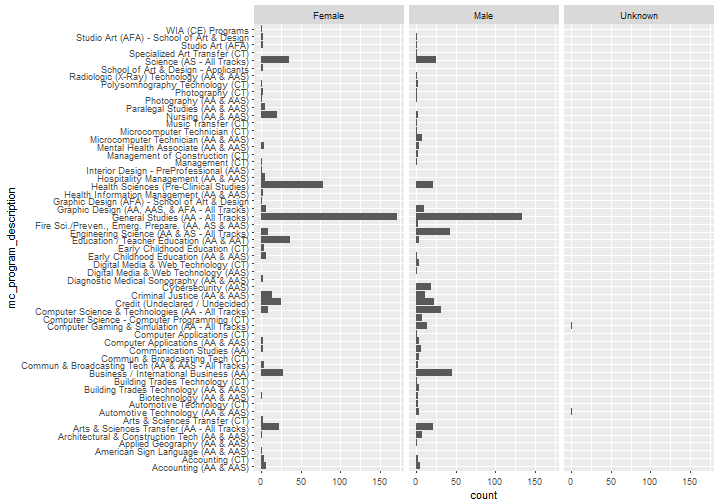
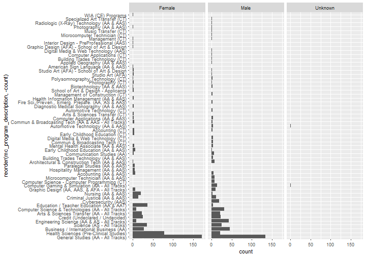

<style>
/* Your other css */
    body {
      background-image: url(https://raw.githubusercontent.com/aarora79/DS_For_HighSchoolers/master/images/background7.png);
      background-position: center center;
      background-attachment: fixed;
      background-repeat: no-repeat;
      background-size: 100% 100%;
      text-color: blue;
    }
.section .reveal .state-background {
    background-image: url(http://goo.gl/yJFbG4);
    background-position: center center;
    background-attachment: fixed;
    background-repeat: no-repeat;
    background-size: 100% 100%;
}
</style>

Lecture 4: Data Science for High Schoolers 
========================================================
author: Amit Arora
date: 2018-01-02
autosize: true

Exploratory Data Analysis
========================================================

 - Ok so we have the data but the raw numbers/text are not very useful.
  - We need quantitative as well as visual description of the data.
 - Going back to why we are wroking with this data? We need answers to questions which we think this data can provide.
 - We need to conduct an <b>exploration</b>...
 - The exploration can be statistical, visual. Usually it is both.
 
Using Statistics to understand the data
========================================================
 - We use *descriptive statistics*.
  - Mean/Median/Quantiles for continous data. For example what is the average number of students each city sends to a community college? What is the 95th percentile/quantile of the same.
   - 95th quantile for example refers to  (in the above example) the number of which is greater than or equal to number of students sent by 95% of the cities. 
- For categorical data, we use mode instead of mean or median. "Mode" is a data value that appers most often. But it is usually more useful to do a frequency count and then sort it rather than to just look at the mode (remember the barplot example).

Using Statistics to understand the data (contd.)
========================================================
- We use the "summary" function in R to get a quick summary.

```
         age_group                attend_day_or_evening
 20 or Younger:434   Day & Evening           :191      
 21 - 24      :253   Day Only                :639      
 25 - 29      :117   Evening Only            :106      
 30 or Older  :196   No Specific Time[online]: 64      
                                                       
                                                       
                                                       
 attending_germantown attending_rockville attending_takoma_park_ss
 No :706              No :365             No :668                 
 Yes:294              Yes:635             Yes:332                 
                                                                  
                                                                  
                                                                  
                                                                  
                                                                  
              city_in_md           county_in_md        ethnicity  
 Silver Spring     :254   Montgomery     :897   Hispanic    :255  
 Gaithersburg      :131   Prince George's: 64   Not Hispanic:714  
 Rockville         :124   Other          : 29   Unknown     : 31  
 Germantown        :120   Washington     :  3                     
 Bethesda          : 36   Baltimore      :  2                     
 Montgomery Village: 30   Howard         :  2                     
 (Other)           :305   (Other)        :  3                     
   fall_term        gender               hs_category 
 Min.   :2015   Female :515   Foreign Country  :179  
 1st Qu.:2015   Male   :483   GED              : 30  
 Median :2015   Unknown:  2   Home-Schooled    : 15  
 Mean   :2015                 MCPS             :535  
 3rd Qu.:2015                 Mont.County Other: 26  
 Max.   :2015                 Other Maryland   : 65  
                              Other State      :150  
                                mc_program_description
 General Studies (AA - All Tracks)         :306       
 Health Sciences (Pre-Clinical Studies)    : 99       
 Business / International Business (AA)    : 73       
 Science (AS - All Tracks)                 : 60       
 Engineering Science (AA & AS - All Tracks): 52       
 Credit (Undeclared / Undecided)           : 48       
 (Other)                                   :362       
                       mcps_high_school              race     state   
                               :465     White          :400   DC: 29  
 Montgomery Blair High School  : 34     Black          :302   MD:969  
 Colonel Zadok Magruder HS     : 32     Asian          :144   MO:  1  
 Northwest HS - Germantown     : 32     Hispanic       : 80   WV:  1  
 Albert Einstein HS & MC Art Cn: 29     Multi-Race     : 33           
 John F. Kennedy High School   : 29     Native American: 25           
 (Other)                       :379     (Other)        : 16           
   student_status               student_type      zip       
 Full-Time:340    Continuing          :735   Min.   :20001  
 Part-Time:660    HS Student          : 25   1st Qu.:20852  
                  New                 :187   Median :20876  
                  New/No HS           :  1   Mean   :20894  
                  Transfer            :  2   3rd Qu.:20902  
                  Transfer no degree  : 39   Max.   :65203  
                  Transfer with degree: 11   NA's   :4      
```

Using Statistics to understand the data (contd.)
========================================================
- Now lets draw some plots that help understand the data. We already drew the barplot. Lets now draw some plots for *derived features* i.e. features/variables/columns that dont exist in the dataset as received but can be **derived**.

```r
library(dplyr)
df_course_by_gender = df %>%
  group_by(gender, mc_program_description) %>%
  summarise(count = n()) %>% arrange(desc(count))
df_course_by_gender
```

```
# A tibble: 86 x 3
# Groups:   gender [3]
   gender                            mc_program_description count
   <fctr>                                            <fctr> <int>
 1 Female                 General Studies (AA - All Tracks)   172
 2   Male                 General Studies (AA - All Tracks)   134
 3 Female            Health Sciences (Pre-Clinical Studies)    78
 4   Male            Business / International Business (AA)    45
 5   Male        Engineering Science (AA & AS - All Tracks)    43
 6 Female          Education / Teacher Education (AA & AAT)    36
 7 Female                         Science (AS - All Tracks)    35
 8   Male Computer Science & Technologies (AA - All Tracks)    31
 9 Female            Business / International Business (AA)    28
10 Female                   Credit (Undeclared / Undecided)    25
# ... with 76 more rows
```

Same information seen via charts
========================================================

```r
library(ggplot2)


p <- df_course_by_gender %>%
  ggplot(aes(x=mc_program_description, y=count)) +
  geom_bar(stat="identity") + coord_flip() + 
  facet_wrap(~gender)
p
```




Code continued..
========================================================

```r
p <- df_course_by_gender %>%
  ggplot(aes(x=reorder(mc_program_description, -count), y=count)) +
  geom_bar(stat="identity") + coord_flip() + 
  facet_wrap(~gender)
p
```




Excecise.
========================================================
Pick another variable annd do similar analysis, generate similar plots

