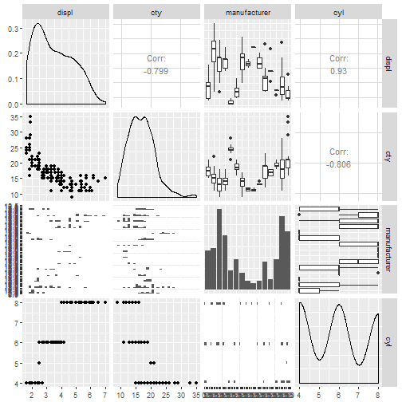
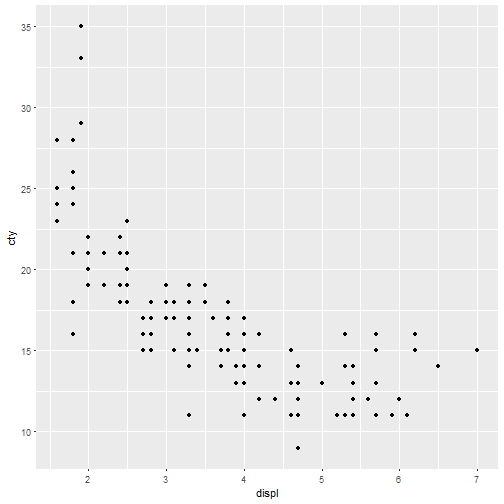
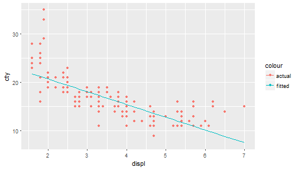

<style>
/* Your other css */
    body {
      background-image: url(https://raw.githubusercontent.com/aarora79/DS_For_HighSchoolers/master/images/background7.png);
      background-position: center center;
      background-attachment: fixed;
      background-repeat: no-repeat;
      background-size: 100% 100%;
    }
.section .reveal .state-background {
    background-image: url(http://goo.gl/yJFbG4);
    background-position: center center;
    background-attachment: fixed;
    background-repeat: no-repeat;
    background-size: 100% 100%;
}
</style>

<style>
.small-code pre code {
  font-size: 1em;
}
</style>

Lecture 6: Finding relationships between features, Linear Models
========================================================
author: Amit Arora
date: 2018-01-07
autosize: true

Some Math Review
========================================================

Equation of a straight line: <b>y = mx + b</b>
What does this mean? In real world terms, not in terms of x and y.
 - It means that we can determine y if we know x, it means that a real world thing represented by the variable y can be determined using this equation if we know the real world thing x. 
 
 - In this equation b represents the value of y if x is 0 and m represents the change in the value of y for a unit change (a change of 1) in x.
 
But how is this related to data science?
========================================================

Well one of the objectives we have in data science is to say given what we know how can we determine (as accurately as possible) what we dont know. 

It is like saying we know the value of x and we dont know y but using this equation y = mx + b we can determine y.

Lets take an example
 
Putting this more in data science context with an example
========================================================
 
Lets take a dataset called "mpg" that comes built in with the ggplot library. This dataset tells about fuel economy of cars.

We want to determine a relationship between the city mileage (the feature cty in the dataset) of a car and some other variable (lets only consider one variable for simplicity).

Why do we want to do this? 
 - Well, because lets say if we find a way to determine the mileage based on some other easily known factors then we can determine the estimate of the mileage of a new car without having to actually drive it around the city.
  - (ofcourse this is a simplified example meant only for helping to understand the concepts).

Ok that is useful, but we are not there yet!
========================================================
So we now have a two fold problem.

- Firstly, what is that feature in the dataset which will help us determine the city mileage.
 
- Secondly, once we know this feature and want to create a linear equation with this feature as the 'x' variable what are the values of 'm' and 'b' in the equation.

Lets see how to solve this.

cty Vs displ in the mpg dataset
========================================================
The first problem is what is known as "feature selection".
 - What features to choose to determine the "response" variable of interest.
  - The response variable is also known as the dependant variable and the features used to determine the dependant variable are also known as independant variables.
 - We use the GGally::ggpairs function to see which features appear to statistically correlated (see code and the scatter matrix plot).

Scatter Matrix
========================================================

 - We see that displ and cty have a correlation of almost -0.80. 
 - This is a high negative correlation, in simple terms it means that cty and displ are related.
  + We can say something about one variable if we know the other and the negative means that when one of these variables goes up the other one goes down.
  
cty Vs displ plot
========================================================
class: small-code
We can plot these two variables using a scatter plot.

```r
library(ggplot2)
mpg %>%
  ggplot(aes(x=displ, y=cty)) +
  geom_point()
```


cty Vs displ plot
========================================================
class: small-code
What do we observe from the plot?
 - we see that plot does look negatively correlated.
  + As the displacement inreases the city mileage decreases. 
  + While the plot does not look completely linear i.e. it does not look like we can overlay a straight line to cover the entire range (especially at the very low and very high values), lets still try to model it


Linear model for cty Vs displ
========================================================
class: small-code
We use the "lm" function provided by the stats library to create the linear model. 

The values of 'm' and 'b' in our linear equation are called 'coefficients' of the linear model. 

```r
lm_fit = lm(cty ~ displ, mpg)
coeff = coefficients(lm_fit)
coeff
```

```
(Intercept)       displ 
  25.991467   -2.630482 
```
We know the coefficients so we can now write down the linear model

```r
cat(sprintf("the linear model is cty = %.2f + (%.2f)*displ", coeff[1], coeff[2]))
```

```
the linear model is cty = 25.99 + (-2.63)*displ
```

Linear model for cty Vs displ - how accurate is it?
========================================================
So now we have the equation of the straight line which can determine the value of cty given displ.

This is very neat, but how accurate is our estimate?

 + We determine this by finding out what values of cty does our linear model determine for the data that we used to *train* our model.
 
 + Once we know the values for what the linear model/equation says for already known data we can determine how far is this value from the *actual* value that we already have. 
 
 + We do this by simply subtracting what is known as the **fitted** value from the actual value. 

Residuals
========================================================

The difference between the fitted value and the actual value is called a *residual* or just error.

The residuals can be positive or negative i.e. sometimes the linear model could determine values that are greater than actual values and sometimes smaller than the actual values.

To be able to speak in terms of absolute values without worrying about the positive or negative sign we square the error.

It follows that there would be a residual/error value for each row/observation in the datset, so we then average out the squared errors and then take the square root of the mean squared error,

This final quantity that we just derived is called a "root mean squared error". 

Lets see what is this value for our model.

Linear model for cty Vs displ - how accurate is it?
=======================================================
class: small-code
We can calculate the RMSE as follows.

```r
#root mean square error
rmse = sqrt(mean((lm_fit$fitted.values  - mpg$cty)^2))
cat(sprintf("the model has a root mean squared error of %.2f", rmse))
```

```
the model has a root mean squared error of 2.56
```

We can now express our result by saying that the equation cty = 25.99 + (-2.63)displ can determine the city mileage given displacement with an average error of 2.56 miles/gallon.

In other words, the mileage values we determine could be on an average within actual value - 2.56 and actual value  + 2.56. Note that it is possible that in some cases the error is higher than 2.56 but *on an average*  this is the error.

A convenient way to plot the linear model
=======================================================
class: small-code
The straight line represents the values that the model calculated for a given displacement value. We can see that the actual values lie sometimes above the line and sometimes below the line, so the straight line is sort of *moving the values towards the average*.


```r
mpg$fitted_values = lm_fit$fitted.values
mpg %>%
  ggplot(aes(x=displ)) + geom_point(aes(y=cty, col="actual")) + geom_line(aes(y=fitted_values, col="fitted")) 
```



Things that we glossed over
=======================================================

In order to introduce the concept of a linear model as a practical use of a linear equation we glossed over a lot of things.

- There are statistical measures to determine if the independant variable we choose is significant or not i.e. can it be even used or not.

- The residuals should form  normal distribution.

- WE should have done a test/train split instead of using the entire dataset for creating the linear model we should have choosen sey 80% of the observations and kept the remaining 20% for testing to see if our model does well (low RMSE) on unseen i.e. new data.

- There are more.
